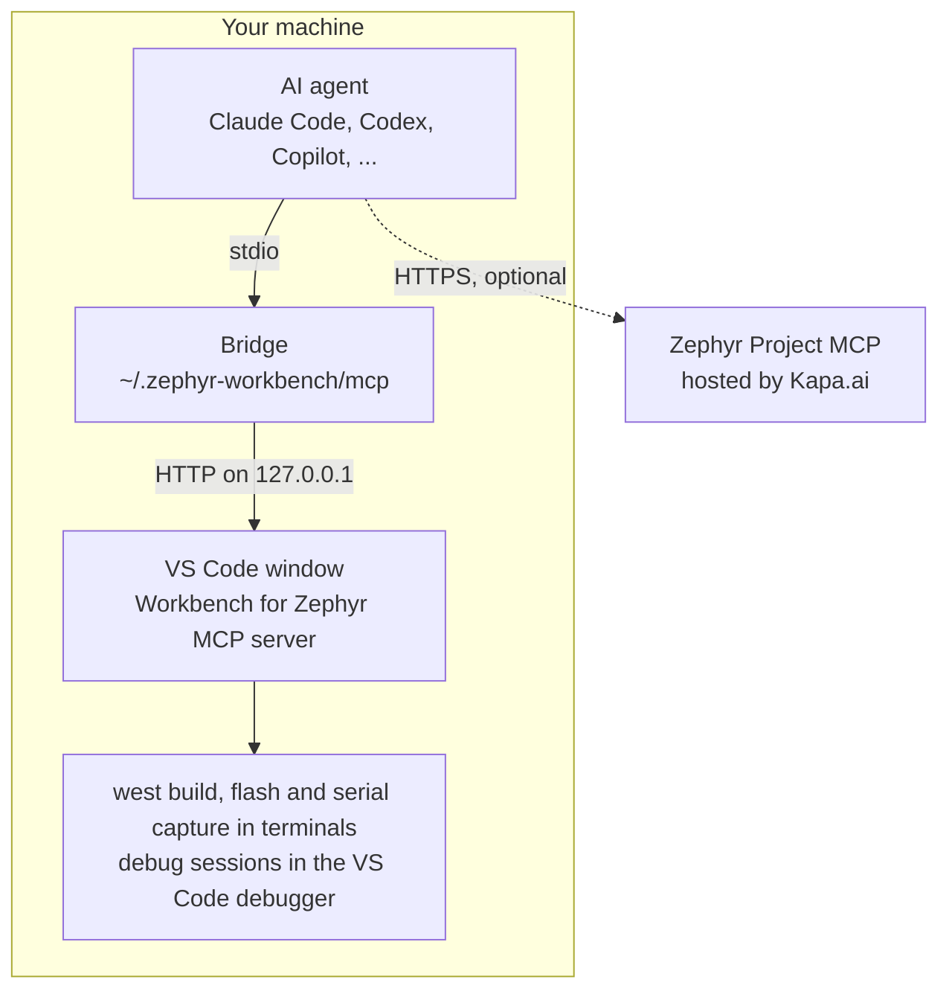

# AI Manager

The AI Manager connects AI coding agents, such as Claude Code, OpenAI Codex or GitHub Copilot, to Workbench for Zephyr. A connected agent works on your applications the way you do in VS Code: it builds them in a terminal you can watch and stop, reads the compiler errors with their file and line and fixes them, reads Kconfig values, the resolved devicetree and the memory usage of a build, flashes a board, reads its serial console and runs debug sessions.

The AI Manager is where you connect your agents, choose what they may do without asking you, and find requests to try. It also connects agents to the Zephyr Project's own MCP server and lists Zephyr agent skills written by others.

:::note
The AI Manager is available from Workbench for Zephyr 4.3.0. Flashing, debugging, installing runners, running commands and the "Examples" tab need 4.3.1 or later. Its MCP server needs VS Code 1.90 or later.
:::

## How it works

Agents talk to Workbench for Zephyr through a local MCP server that runs inside VS Code. The agent starts a small bridge program, which forwards each request to the VS Code window that has the application open.

- The agent configuration only names the bridge. It holds no port and no key, so one setup serves every project and every VS Code window.
- The server only accepts local connections, and each request needs a key that changes every time VS Code starts.
- By default the server stays idle until an agent connects to it.
- The [Zephyr Project MCP](#zephyr-project-mcp) is a separate, hosted server. Questions you send to it leave your machine.

## Open the AI Manager

Use one of:

- The "AI Manager" item in the "Managers" view of the Workbench for Zephyr side bar
- The command palette: "Zephyr Workbench: AI Manager"
- The "MCP" status bar item

The AI Manager has three pages:

- **Zephyr Workbench MCP**: connect your agents to Workbench for Zephyr, choose their permissions and find example requests.
- **Zephyr Project MCP**: connect your agents to the Zephyr Project's documentation server.
- **Third-party skills**: Zephyr agent skill collections written by others.

## Connect an agent

On the "Zephyr Workbench MCP" page, the "Connections" tab lists the agents found on this machine under "Installed". The others are under "Not installed", and you can still connect one before you install it.

1. Click "Connect" next to your agent.

2. Review the change, then click **Update** (or **Create**, or **Run** for Claude Code). The dialog shows the file and the exact lines that will be written. For Claude Code, it shows the two Claude CLI commands it runs: the first removes any previous Zephyr Workbench entry, the second adds the new one. Nothing is written before you confirm.

3. Restart the agent session so it loads the server, then ask it something, for example "Is my Zephyr setup ready?".

:::tip
GitHub Copilot in VS Code 1.101 or later needs no setup: Workbench for Zephyr registers its server with VS Code directly, and the row reads "Connected automatically". When Workbench for Zephyr runs inside Cursor, it also registers its server with Cursor directly, so Cursor needs no setup either. The Cursor row does not show this and can still read "Not connected".
:::

The supported agents and the files the AI Manager writes (`~` is your home folder):

| Agent | All projects | This project |
| --- | --- | --- |
| Claude Code | `~/.claude.json`, through the Claude CLI | `.mcp.json` |
| OpenAI Codex | `~/.codex/config.toml` | |
| GitHub Copilot in VS Code | Registered automatically | `.vscode/mcp.json` |
| Cursor | `~/.cursor/mcp.json` | `.cursor/mcp.json` |
| Antigravity | `~/.gemini/config/mcp_config.json` | |
| opencode | `~/.config/opencode/opencode.json` | `opencode.json` |
| GitHub Copilot CLI | `~/.copilot/mcp-config.json` | `.mcp.json` |

Before it rewrites a file, the AI Manager saves a copy of it in `~/.zephyr-workbench/mcp/backups`. For OpenAI Codex, whose file usually holds your own settings too, the entry is written as a marked block.

### All projects or this project

Click an agent to expand it. Each line is one place the agent reads its servers from:

- **All projects**: your user configuration. The entry serves every project. This is what "Connect" on the collapsed row does.
- **This project**: a file in the first folder of the VS Code workspace. On macOS and Linux, the entry finds the bridge through each user's home folder, so the file works for everyone who has Workbench for Zephyr and can be committed. On Windows, the entry holds the path of your VS Code installation, so it only works for you: keep the file out of version control. The dialog says which case applies.

Each line has its own status and buttons:

- "Needs updating", with "Repair": the entry no longer matches this installation, for example after VS Code moved. Click "Repair" to rewrite it.
- "Edited by hand", with "Open file": the file could not be read, usually because of a syntax error. Fix it, then click "Connect" again.
- "Remove": removes the Zephyr Workbench entry only. The rest of the file is kept.

### Another MCP client

For an agent that is not listed, open "Manual setup" at the bottom of the agent list. It shows the command to run as a local (stdio) MCP server. On Windows, the line under it gives the environment variable the command needs, `ELECTRON_RUN_AS_NODE=1`. "Copy configuration for an agent", or the command palette entry "Zephyr Workbench: Copy MCP Configuration for an Agent", copies a ready-made entry for the agent you pick, or a generic `mcpServers` entry with "Another MCP client". Merge it into the agent's configuration file, then restart the agent session.

## Check the connection

Click "Test connection" on the server card. It starts the server and reaches it the way an agent does, then shows the result under the card. When a check fails, the line says what to fix. "Show report" opens the full report in the "Zephyr Workbench: MCP" output.

The same test runs from the command palette: "Zephyr Workbench: Check AI Agent Connection (MCP)".

The server card also gives:

- **Restart** and **Stop**: after "Stop", agents cannot start the server again until you start it with "Start", "Test connection" or "Connect". Reloading the VS Code window also ends the stop.
- **Show activity log**: opens the "Zephyr Workbench: MCP" output, which records every agent request and every answer you gave.

Under "Server" on the "Connections" tab, "Recent jobs" lists the builds, flashes and other long actions agents started in this window.

## Choose what agents may do

Open the "Permissions" tab and pick a preset:

- **Core** (default): agents build and inspect without asking. They also change Kconfig options, build configurations and debug configurations without asking. They ask before they create or import an application, change a west workspace, install a toolchain or a runner, flash, debug or send text to a board, and before they run a command. They cannot delete anything.
- **Full**: agents use every tool without asking. They still ask every time before an action that accepts a license for you, such as installing J-Link or fetching binary blobs with their licenses accepted.
- **Custom**: your own choice for each tool.

Below the presets, each tool has three choices. Point at the info icon next to a tool name to read what it does.

- **Allow**: the agent uses the tool without asking.
- **Ask**: VS Code asks you before the tool changes anything, or before each use for a tool that never changes anything.
- **Block**: the agent does not see the tool at all.

Changing any tool switches the preset to Custom. Picking Core or Full keeps your Custom choices, so picking Custom again brings them back. Changing a tool while Core or Full is selected replaces your Custom choices with that preset's choices plus your change.

:::note
Permissions are read from your User settings only. A project's `.vscode/settings.json` cannot give agents more rights.
:::

### Answer an agent's request

When a tool set to Ask is about to act, VS Code shows a dialog with the agent's name, the application, the board and the exact command. While it waits, the "MCP" status bar item reads "MCP: answer needed".

- **Allow**: this action only.
- **Allow for This Session**: stops asking this agent before the same kind of action on the same application, west workspace or serial port until the MCP server restarts. For toolchain and runner installs it covers the whole machine. The dialog says what it covers.
- **Cancel**: refuses. The agent is told you declined and not to try again unless you ask. For one minute, the same request from that agent is refused without a dialog.

Answer within about 40 seconds. After that the agent is told nobody answered, but the dialog stays open: if you allow it then, the agent can repeat the same request within 5 minutes without asking again. The delay follows the `zephyr-workbench.mcp.defaultWaitSeconds` setting.

To make agents ask again before the actions you allowed for the session, click "Forget session approvals" on the "Permissions" tab. The button shows next to the tool counts, with the number of approvals, once you have chosen "Allow for This Session". Stopping or restarting the server does the same.

## Try an example

The "Examples" tab lists requests to try, grouped by task: Setup, Build, Flash, Debug and More. Click the copy icon next to a request, then paste it into your agent, or ask in your own words. A request that needs a tool you blocked is dimmed.

To follow a full session, from a new application to a board in the loop, see the tutorial [Develop on a board with an AI agent](../tutorials/ai-agent-hardware-in-the-loop.md).

## Zephyr Project MCP

The "Zephyr Project MCP" page connects your agents to the Zephyr Project's own MCP server, run by Kapa.ai. It answers questions from the Zephyr documentation, source code and GitHub activity, with its sources.

It is a hosted service: your questions leave your machine, and the first time an agent uses it you sign in once in your browser. Answers are AI-generated and can be wrong, so check what matters in the documentation.

Connecting works as on the first page. The differences:

- For GitHub Copilot in VS Code, "Add to VS Code" opens VS Code's own install prompt. Remove the server later from the VS Code MCP Servers view.
- For Claude Code, the page asks the Claude CLI which servers it reaches, so a connector added to your Claude account shows as "Connected through your account".
- "Not set up on this machine": no configuration file on this machine has the server. Only Claude Code is asked about the servers of its online account, so for the other agents a server you added through your account does not show here.
- After connecting, the confirmation message tells how to sign in with the agent. The same line shows when you expand the agent, until the agent reports the server as connected.

"Data sources", under "Server", lists what the server answers from and how often each source is refreshed. "Manual setup" gives the configuration for any other MCP client.

## Third-party skills

The "Third-party skills" page lists Zephyr skill collections for AI agents, written by others. "Open" opens the collection's page, and "How to install" gives the commands to copy. Read a skill before you rely on it.

## Troubleshooting

- If the agent reports that no VS Code window is running Zephyr Workbench, open the application folder in VS Code and check that the `zephyr-workbench.mcp.enabled` setting is not `off`.
- If the agent does not see the Zephyr Workbench tools, restart the agent session after connecting it, then click "Test connection".
- If an agent reads "Needs updating", click "Repair". On Windows the entry names the VS Code executable, so moving VS Code to another folder needs a repair.
- With several VS Code windows open, each request goes to the window that has its application open. When several windows could take a request, the agent is told to name the application.
- If a serial capture fails because the port is busy, close the Serial Monitor or any other program that holds the port, then ask again.

## Tools

The tools agents get, as the "Permissions" tab groups them, with their permission under the Core preset:

| Tool | What it does | Core |
| --- | --- | --- |
| `get_status` | Gives an overview of the window: applications, west workspaces, toolchains, readiness and running jobs. | Allow |
| `check_environment` | Checks that the host tools, the Python environment, the Zephyr SDKs and the flash and debug tools are installed and ready. | Allow |
| `list_apps` | Lists the applications with their build configurations: board, build folder and whether they are built. | Allow |
| `list_toolchains` | Lists the installed Zephyr SDKs and the Arm GNU, IAR and Rust toolchains, and the ones that can be installed. | Allow |
| `search_zephyr_catalog` | Searches a west workspace for boards, shields, snippets, samples, projects and binary blobs. | Allow |
| `get_diagnostics` | Reads the errors and warnings of the last build, including builds you started yourself. | Allow |
| `get_build_info` | Reads the result of the last build: board, toolchain, image sizes, memory use and output files. | Allow |
| `get_memory_report` | Shows what takes up flash and RAM in the firmware, by section, symbol or source folder. | Allow |
| `query_kconfig` | Looks up the Kconfig values of the last build, and why each option has its value. | Allow |
| `query_devicetree` | Finds nodes in the final devicetree of the last build, with the file and line that defined each one. | Allow |
| `list_runners` | Lists the flash and debug runners a built board supports, and whether their tools are installed. | Allow |
| `set_kconfig` | Changes Kconfig options in the application's `prj.conf` or a `.conf` fragment, and checks that each value takes effect. | Allow |
| `configure` | Changes build configurations and application or west workspace settings, as the Workbench views do. | Allow |
| `configure_debug` | Creates or updates the debug configuration of a build, as the Debug Manager does. | Allow |
| `build_app` | Builds a build configuration with west build, in a VS Code terminal. | Allow |
| `analyze` | Runs DT Doctor, the Kconfig hardening check, an SPDX SBOM or ECLAIR, in a VS Code terminal. | Allow |
| `manage_app` | Creates an application from a sample, imports an existing one, or gives it its own Python environment. | Ask |
| `manage_west_workspace` | Creates, imports and updates west workspaces: west update, manifest changes, Python environment and binary blobs. | Ask |
| `manage_toolchain` | Installs and registers toolchains: Zephyr SDKs, Arm GNU, LLVM and Rust. | Ask |
| `manage_runners` | Installs and configures the flash and debug runners, such as OpenOCD, J-Link and pyOCD. | Ask |
| `remove_or_delete` | Removes or deletes build folders, build and debug configurations, applications, west workspaces, toolchains or pyOCD packs. | Block |
| `hardware` | Flashes a connected board with west flash, reads its serial console or sends it a line such as a shell command. | Ask |
| `debug_app` | Starts a debug session on the board, sets breakpoints, steps, and reads variables, registers and memory. | Ask |
| `run_command` | Runs a command line in the Zephyr environment of an application or west workspace, in a VS Code terminal. | Ask |
| `open_in_workbench` | Opens something in VS Code for you: a file at a line, a Workbench view or manager, a memory plot or a wizard. | Allow |
| `job` | Follows a long action such as a build: its status, its log, or cancelling it. | Allow |

With Ask, only the actions that change something ask. For example, `hardware` asks before it flashes or sends a line to the board, but reads the serial console without asking.

The settings of the MCP server are listed in the [Settings Reference](settings-reference.md#ai-agent-mcp-settings).

## Related tools

- [Install Runners](install-runners.md): the flash and debug tools an agent needs to work with a board.
- [Debug Session](debug-session.md): the Debug Manager, which `configure_debug` uses to set up debugging.
- [Kconfig Manager](configuration/kconfig-manager.md): review by hand the Kconfig options an agent changed.

## Training

Ac6 runs a training course on working with AI coding agents in embedded development: [AI-Assisted Embedded Development](https://www.ac6-training.com/en/ai1/ai-assisted-embedded-development).
