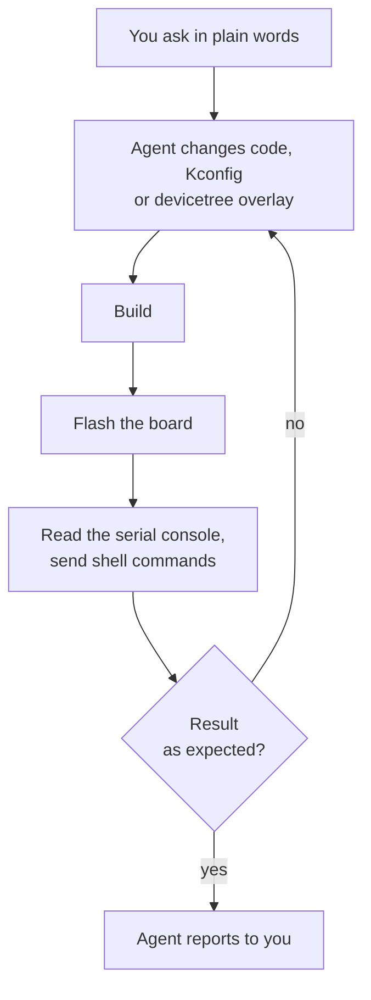

# Develop on a board with an AI agent

This tutorial follows a typical session with an AI coding agent connected to Workbench for Zephyr. You ask in plain words, and the agent creates an application, configures it, builds it, flashes the board and reads the board's serial console to check the result. It then changes the firmware and checks it again on the board, which puts the hardware in the loop. The example uses Claude Code and an NXP FRDM-MCXN947 board. Any connected agent and any board with a serial console work the same way. For the reference of every setting and permission, see [AI Manager](../documentation/ai-manager.md).

## What you will do

1. Create an application from a sample and build it.
2. Configure it: enable the Zephyr shell.
3. Flash the board and read its boot log.
4. Collect data from the board through its shell.
5. Change the firmware and check the change on the board.

:::tip
Each step below is a separate request, to show what happens at each stage. You do not need to split the work: the agent can do the whole session from a single request, for example:

```text
Create an application from the Zephyr hello_world sample
for the FRDM-MCXN947 board. Enable the shell with the kernel commands
and thread stack usage, flash the board and run kernel stacks.
Then give the thread closest to overflowing a larger stack,
flash again and check the result on the board.
```
:::

## Before you start

- A west workspace opened as a folder in VS Code. See [West Workspaces](../documentation/west-workspace.md).
- The board connected over USB. Close any serial monitor that has its port open: a serial port opens in one program at a time.
- An agent connected to Workbench for Zephyr, with the default Core permissions. See [Connect an agent](../documentation/ai-manager.md#connect-an-agent).

You do not need to install the Zephyr SDK or the flash runner of your board first. When one is missing, the agent installs it when it needs it, after asking you. A few runners are only distributed by their vendor, such as LinkServer, the runner the FRDM-MCXN947 uses by default: for those, the agent gives you the download page, or flashes with another runner the board supports, such as pyOCD, which it can install.

:::tip
Agent terminals do not come to the front by default. To see each build, flash and serial terminal come to the front as the agent starts it, set `zephyr-workbench.mcp.revealTerminal` to `always`.
:::

## How the loop works

Each request below is one turn of this loop. The agent builds, flashes and reads the board through Workbench for Zephyr, in VS Code terminals you can watch, and VS Code asks you before each action that touches the board.



## Step 1: create the application and build it

In the agent chat, ask:

```text
Create an application from the Zephyr hello_world sample
for the FRDM-MCXN947 board, and build it.
```

The agent looks up the sample and the board in the west workspace, then asks to create the application. VS Code shows what it will create and where:


Click **Allow**. The application appears in the "Applications" view, and the build runs in the "West Build [primary]" terminal. When the build ends, the agent reports the result and the memory use. If the build fails, the agent reads the errors with their file and line, fixes them and builds again.


## Step 2: configure the application

Ask:

```text
Enable the Zephyr shell with the kernel commands and thread stack usage,
so I can run kernel stacks on the board. Then rebuild.
```

The agent changes the Kconfig options through Workbench for Zephyr, which checks that each value takes effect and writes them in a managed section of `prj.conf`. Under the Core preset this does not ask. Open `prj.conf` to review the section:


The agent only rewrites the managed section. To change these options by hand, edit the section or use the [Kconfig Manager](../documentation/configuration/kconfig-manager.md).

## Step 3: flash the board and read the boot log

Ask:

```text
Flash the board and show me the boot log.
```

Workbench for Zephyr tells the agent to start a capture of the board's serial port before it flashes, so that no line of the boot is lost. The capture runs in a terminal named after the port and its speed, for example "Serial COM5 at 115200 baud". The speed comes from the console of the board's devicetree. Starting the capture does not ask.

Then the agent asks to flash. VS Code shows the board, the runner and the exact `west flash` command:


Click **Allow**, or **Allow for This Session** to let the agent flash this application again without asking until the MCP server restarts. The flash runs in the "West Flash [primary]" terminal. The agent then waits for the boot line in the capture and shows you what the board printed.

:::note
The capture stops by itself after 10 minutes. To stop it earlier, close its terminal.
:::

## Step 4: collect data from the board

Ask:

```text
Run kernel stacks on the board.
Which thread is closest to overflowing its stack?
```

The agent sends `kernel stacks` to the Zephyr shell through the running capture. Sending text to the board asks first, with the exact text and the port. Choose **Allow for This Session** to let the agent send more commands on this port without asking.

The command, and the table the board prints in reply, show in the serial terminal. The agent reads the reply, which gives the size and the usage of each thread's stack, and tells you which thread has the least room left.

## Step 5: change the firmware and check it on the board

Ask:

```text
Give that thread a larger stack, rebuild, flash
and check on the board again.
```

The agent changes the stack size (for the shell or another system thread, a Kconfig option in `prj.conf`), builds, flashes, runs `kernel stacks` again and compares the usage before and after the change. If you chose **Allow for This Session** in the previous steps, it does this without asking again. Each change is checked on the board, not only in the build.

## Check what the agent did

- "Recent jobs", under "Server" in the AI Manager, lists every build, flash and serial capture the agent started in this window.
- "Show activity log", on the server card of the AI Manager, opens the "Zephyr Workbench: MCP" output with every request and every answer you gave.
- The terminals stay open, so you can scroll back through each build and through the serial output.


## Next steps

- Choose what the agent may do without asking: [Permissions](../documentation/ai-manager.md#choose-what-agents-may-do).
- Debug on the board with the agent, for example "Start debugging, stop in main, step a few lines and show me the local variables": [Debug Session](../documentation/debug-session.md).
- More requests to try: the "Examples" tab of the [AI Manager](../documentation/ai-manager.md#try-an-example).
- Learn to work with AI coding agents on embedded projects: the Ac6 training course [AI-Assisted Embedded Development](https://www.ac6-training.com/en/ai1/ai-assisted-embedded-development).
